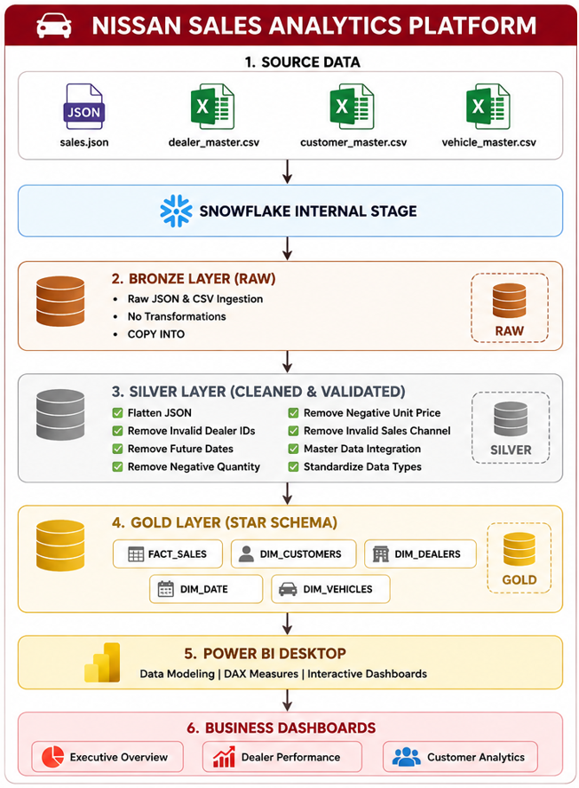
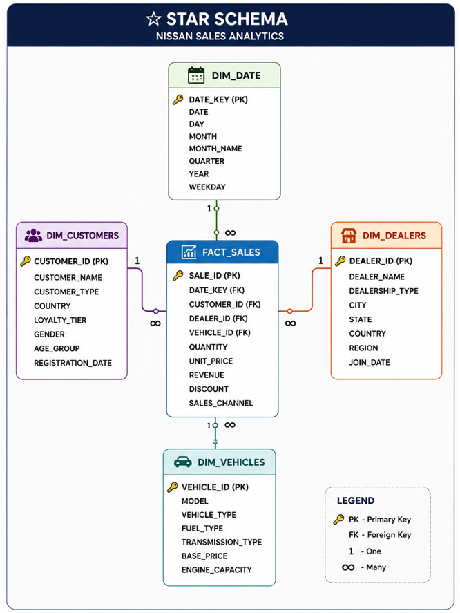
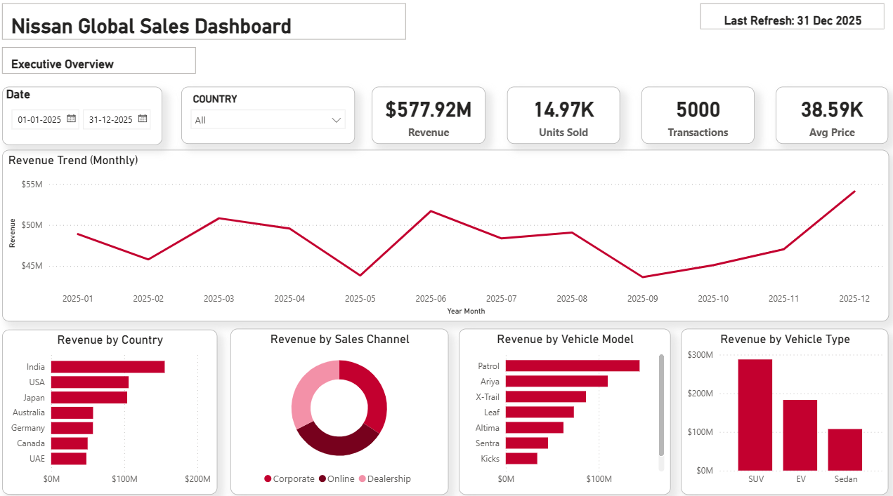
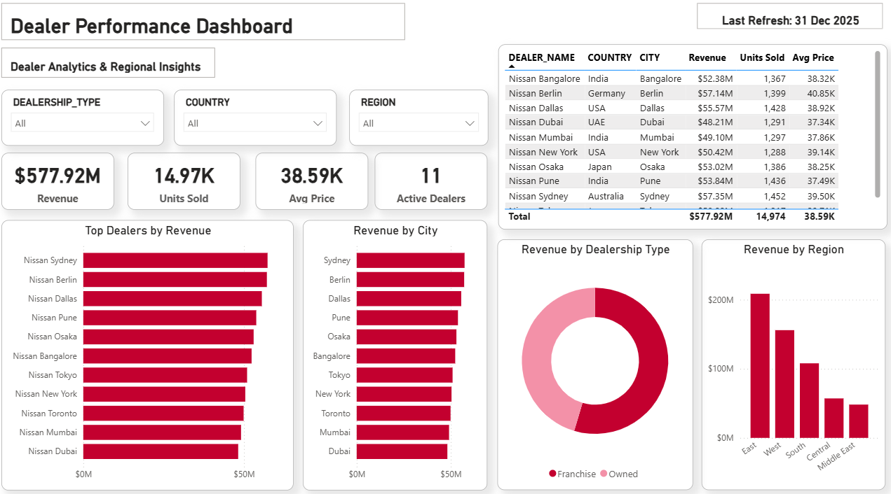
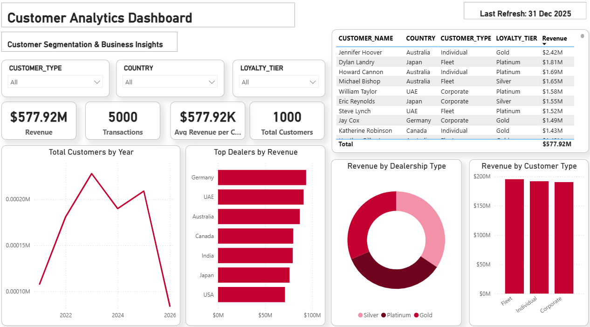

# 🚗 Vehicle Sales Analytics

### End-to-End Data Engineering & Business Intelligence Project


# 🚗 Nissan Sales Analytics Platform

An end-to-end **Data Engineering and Business Intelligence** project built using **Snowflake** and **Power BI**.

This project demonstrates how raw sales data can be transformed into a scalable analytical solution using a modern **Bronze → Silver → Gold** architecture and visualized through interactive Power BI dashboards.

---

# 📌 Project Overview

The objective of this project is to simulate a real-world automotive sales analytics platform.

The solution covers the complete analytics lifecycle:

- Data Ingestion
- Data Cleaning & Validation
- Data Warehouse Design
- Star Schema Modeling
- Interactive Power BI Dashboards

---

# 🏗️ Architecture



---

# ⭐ Star Schema



---

# 🛠️ Technology Stack

| Technology | Purpose |
|------------|----------|
| Snowflake | Cloud Data Warehouse |
| SQL | Data Transformation & ETL |
| Power BI | Dashboard & Reporting |
| DAX | Business Calculations |
| GitHub | Version Control |

---

# 📂 Project Architecture

```
Raw Files (JSON + CSV)
        │
        ▼
Snowflake Internal Stage
        │
        ▼
Bronze Layer
(Raw Data)
        │
        ▼
Silver Layer
(Data Cleaning & Validation)
        │
        ▼
Gold Layer
(Star Schema)
        │
        ▼
Power BI Dashboard
```

---

# 📊 Data Pipeline

## Bronze Layer

- Raw JSON & CSV ingestion
- Internal Stage
- COPY INTO
- No transformations

---

## Silver Layer

Performed data quality validation:

- Removed invalid dealer IDs
- Removed future sales dates
- Removed negative quantity
- Removed negative unit prices
- Removed invalid sales channels
- Data type standardization
- Master data integration

---

## Gold Layer

Created analytical model using Star Schema.

Fact Table

- FACT_SALES

Dimension Tables

- DIM_CUSTOMERS
- DIM_DEALERS
- DIM_DATE
- DIM_VEHICLES

---

# 📈 Power BI Dashboards

## Executive Overview

Features:

- Revenue KPI
- Units Sold KPI
- Average Selling Price
- Transactions
- Monthly Revenue Trend
- Revenue by Country
- Revenue by Sales Channel
- Revenue by Vehicle Type

---

## Dealer Performance

Features:

- Active Dealers
- Revenue by Dealer
- Revenue by Region
- Revenue by City
- Revenue by Dealership Type
- Top Dealers Table

---

## Customer Analytics

Features:

- Customer KPIs
- Revenue by Customer Type
- Customers by Country
- Loyalty Tier Analysis
- Customer Registration Trend

---

# 🧹 Data Quality Checks

Implemented validation for:

- NULL values
- Duplicate records
- Invalid Dealer IDs
- Future Dates
- Negative Quantity
- Negative Unit Price
- Unknown Sales Channel

---

# 📁 Repository Structure

```
Nissan-Sales-Analytics

│
├── SQL
│
├── Dataset
│
├── PowerBI
│
├── Screenshots
│
├── Architecture
│
└── README.md
```

---

# 📸 Dashboard Preview

## Executive Overview



---

## Dealer Performance



---

## Customer Analytics



---

# 🚀 Skills Demonstrated

- ETL Pipeline Development
- Snowflake Data Warehouse
- Bronze-Silver-Gold Architecture
- Star Schema Modeling
- SQL Data Cleaning
- Data Quality Validation
- DAX Measures
- Power BI Dashboard Design
- Business Intelligence
- Git & GitHub

---

# 📌 Future Enhancements

- Snowflake Tasks
- Snowflake Streams
- Incremental Loading
- CI/CD Pipeline
- Row-Level Security
- Power BI Service Deployment
- Automated Data Refresh

---

# 👨‍💻 Author

**Apurva Vaidya**

If you found this project interesting, feel free to connect or provide feedback.
